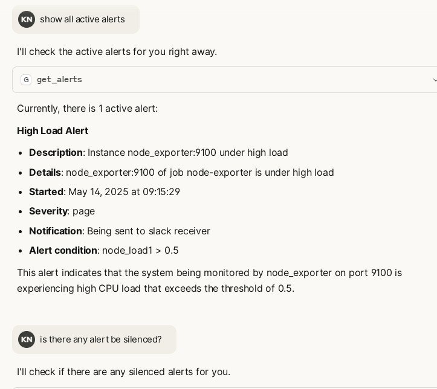

<div align="center">
    <h1>Prometheus Alertmanager MCP</h1>
    <p>
        <a href="https://github.com/ntk148v/alertmanager-mcp-server/blob/master/LICENSE">
            
        </a>
    <a href="https://github.com/ntk148v/alertmanager-mcp-server/stargazers">
        
    </a>
</div>

## Table of Contents
- [Table of Contents](#table-of-contents)
- [1. Introduction](#1-introduction)
- [2. Features](#2-features)
- [3. Quickstart](#3-quickstart)
  - [3.1. Prerequisites](#31-prerequisites)
  - [3.2. Local Run](#32-local-run)
  - [3.3. Docker Run](#33-docker-run)
- [4. Tools](#4-tools)
- [5. Development](#5-development)
- [6. License](#6-license)

## 1. Introduction

Prometheus Alertmanager MCP is a [Model Context Protocol](https://modelcontextprotocol.io/) (MCP) server for Prometheus Alertmanager. It enables AI assistants and tools to query and manage Alertmanager resources programmatically and securely.

## 2. Features

- [x] Query Alertmanager status, alerts, silences, receivers, and alert groups
- [x] Create, update, and delete silences
- [x] Create new alerts
- [x] Authentication support (Basic auth via environment variables)
- [x] Docker containerization support

## 3. Quickstart

### 3.1. Prerequisites

- Python 3.12+
- [uv](https://github.com/astral-sh/uv) (for fast dependency management).
- Docker (optional, for containerized deployment).
- Ensure your Prometheus Alertmanager server is accessible from the environment where you'll run this MCP server.

### 3.2. Local Run

- Clone the repository:

```bash
# Clone the repository
$ git clone https://github.com/ntk148v/alertmanager-mcp-server.git
```

- Configure the environment variables for your Prometheus server, either through a .env file or system environment variables:

```shell
# Set environment variables (see .env.sample)
ALERTMANAGER_URL=http://your-alertmanager:9093
ALERTMANAGER_USERNAME=your_username  # optional
ALERTMANAGER_PASSWORD=your_password  # optional
```

- Add the server configuration to your client configuration file. For example, for Claude Desktop:

```json
{
  "mcpServers": {
    "alertmanager": {
      "command": "uv",
      "args": [
        "--directory",
        "<full path to alertmanager-mcp-server directory>",
        "run",
        "src/alertmanager_mcp_server/server.py"
      ],
      "env": {
        "ALERTMANAGER_URL": "http://your-alertmanager:9093s",
        "ALERTMANAGER_USERNAME": "your_username",
        "ALERTMANAGER_PASSWORD": "your_password"
      }
    }
  }
}
```

- Restart Claude Desktop to load new configuration.
- You can now ask Claude to interact with Alertmanager using natual language:
  - "Show me current alerts"
  - "Filter alerts related to CPU issues"
  - "Get details for this alert"
  - "Create a silence for this alert for the next 2 hours"




### 3.3. Docker Run

- Run it with pre-built image (or you can build it yourself):

```bash
$ docker run -e ALERTMANAGER_URL=http://your-alertmanager:9093 \
    -e ALERTMANAGER_USERNAME=your_username \
    -e ALERTMANAGER_PASSWORD=your_password \
    -p 8000:8000 ghcr.io/ntk148v/alertmanager-mcp-server
```

- Running with Docker in Claude Desktop:

```json
{
  "mcpServers": {
    "alertmanager": {
      "command": "docker",
      "args": [
        "run",
        "--rm",
        "-i",
        "-e", "ALERTMANAGER_URL",
        "-e", "ALERTMANAGER_USERNAME",
        "-e", "ALERTMANAGER_PASSWORD",
        "ghcr.io/ntk148v/alertmanager-mcp-server:latest"
      ],
      "env": {
        "ALERTMANAGER_URL": "http://your-alertmanager:9093s",
        "ALERTMANAGER_USERNAME": "your_username",
        "ALERTMANAGER_PASSWORD": "your_password"
      }
    }
  }
}
```

This configuration passes the environment variables from Claude Desktop to the Docker container by using the `-e` flag with just the variable name, and providing the actual values in the `env` object.

## 4. Tools

The MCP server exposes tools for querying and managing Alertmanager, following [its API v2](https://github.com/prometheus/alertmanager/blob/main/api/v2/openapi.yaml):
- Get status: `get_status()`
- List alerts: `get_alerts()`
- List silences: `get_silences()`
- Create silence: `post_silence(silence_dict)`
- Delete silence: `delete_silence(silence_id)`
- List receivers: `get_receivers()`
- List alert groups: `get_alert_groups()`

See [src/alertmanager_mcp_server/server.py](src/alertmanager_mcp_server/server.py) for full API details.

## 5. Development

Contributions are welcome! Please open an issue or submit a pull request if you have any suggestions or improvements.

This project uses [uv](https://github.com/astral-sh/uv) to manage dependencies. Install uv following the instructions for your platform.

```bash
# Clone the repository
$ git clone https://github.com/ntk148v/alertmanager-mcp-server.git
$ uv venv
$ source .venv/bin/activate  # On Unix/macOS
$ .venv\Scripts\activate     # On Windows
$ uv pip install -e .
# run test
$ pytest
```

## 6. License

[Apache 2.0](LICENSE)

---

<div align="center">
    <sub>Made with ❤️ by <a href="https://github.com/ntk148v">@ntk148v</a></sub>
</div>
